# Loop and Thread
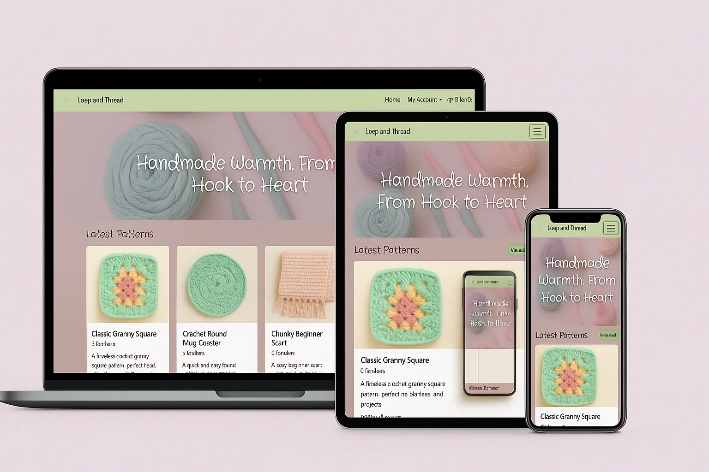
 
**Loop & Thread** is a cozy and user-friendly e-commerce platform designed for crochet enthusiasts to discover, purchase, and download beautiful handmade crochet patterns. The goal of the project is to provide a seamless browsing and shopping experience, allowing users to explore a curated selection of patterns, manage their accounts, and complete secure purchases with ease. Built with Django and following best practices in full-stack development, Loop & Thread focuses on creating a warm, welcoming space that blends creativity with functionality, celebrating the craft of crochet while offering a smooth and engaging user experience from start to finish.

## Table Of Contents:
1. [Design & Planning](#design-&-planning)
    * [User Stories](#user-stories)
    * [Wireframes](#wireframes)
    * [Typography](#typography)
    * [Colour Scheme](#colour-scheme)

    
2. [Features](#features)
    * [Navigation](#navigation)
    * [Other features](#other-features)

3. [Technologies Used](#technologies-used)
4. [Testing](#testing)
5. [Bugs](#bugs)
6. [Deployment](#deployment)
7. [Credits](#credits)

## Design & Planning:

### User Stories
[Here](userstories.md) you'll find the user stories for my project.

This page contains links to my user stories in my GitHub project and will have corresponding screenshots/screen recordings of the completed tasks.
### Wireframes
[Click here](wireframes.md) to view all the wireframes for this project.

### Typography
For this project I've gone for the Crafty Girl font from the Google Fonts site. I felt that this really fits the vibe of crocheting and allows for a relaxed but fun feel.

### Colour Scheme

I used the page's Eye Dropper extention to find a color that I could bounce off.

Eye Dropper screenshot

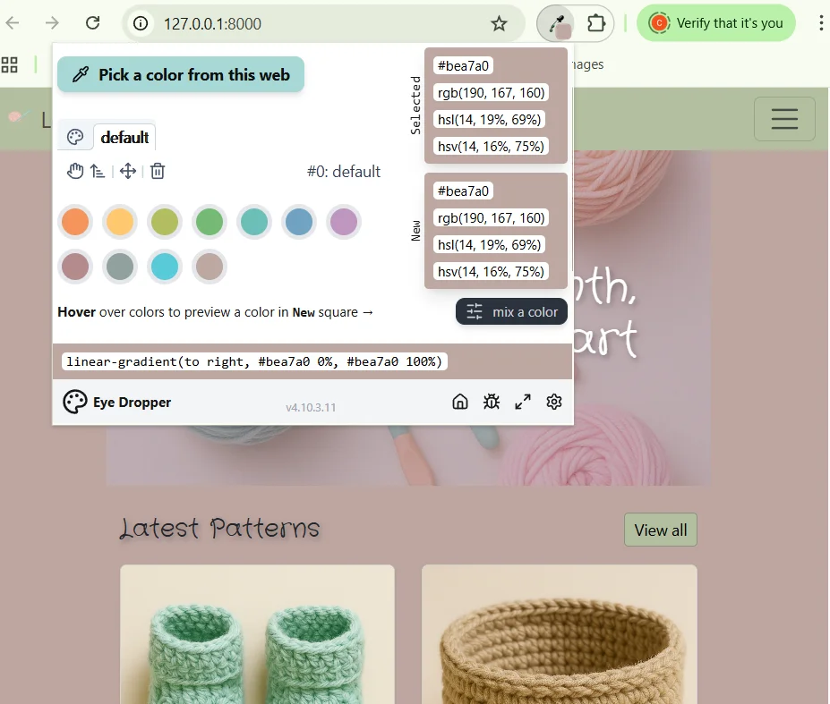

 

Then from that selection I used Colorspace to create a palette for my site.

Colorspace

- I went with this color scheme for a more classy look. My past project had a bonkers feel to them so I've tamed it down with this one. I wanted a cozy and comfy color pallet for this website as I feel that crocheting has that effect(on me anyways).

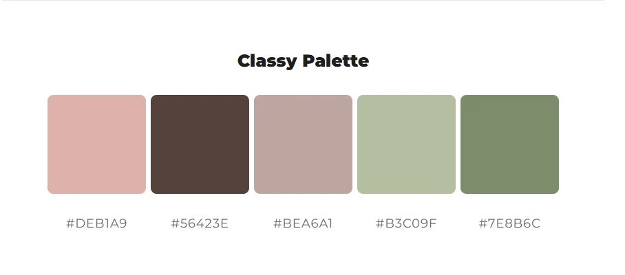

## Features:
Here are the features for the website. Very minimal as I wanted to create a website that was easy to use and easy to look at.

 

Navigation

Navigation throughout Loop & Thread is designed to be simple, intuitive, and consistent across all devices.
The main navigation bar provides quick access to the Home page, the My Account section (for both customers and store owners), and the Basket, ensuring users can find what they need in just one click.

#### Key Features

- A clean, minimal design that complements the soft color palette of the site

- Smooth transition between desktop and mobile layouts

- Clearly labelled links and icons for effortless browsing

- The basket icon dynamically updates, giving a visual cue of items added

Mobile navigation

On smaller screens, navigation neatly condenses into a burger-menu in the top-right corner.
When tapped, it expands to reveal the full set of menu links in a soft drop-down panel, maintaining both clarity and style.

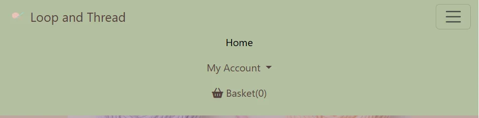

Desktop navigation

On larger screens, navigation is displayed across the top in a tidy horizontal layout, allowing instant access to all key areas without clutter.

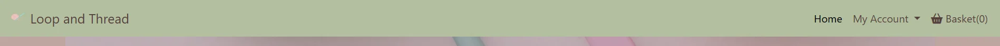

### Other features

Single-Purchase Pattern Validation

To provide a smooth and logical shopping experience, each crochet pattern can only be purchased once per order. Because Loop & Thread patterns are digital downloads, allowing multiple copies of the same item in the bag would be unnecessary and potentially confusing at checkout.

##### How It Works

- When a customer clicks “Add to bag”, the app checks whether that pattern already exists in the session bag.

- If the same pattern is detected, the system prevents duplication and triggers a Bootstrap toast pop-up message that reads:

  - “You already have this in your bag.”

- If the pattern is not yet in the bag, it’s added successfully, followed by a green success toast confirming the addition.

##### Why It Matters

- Prevents users from accidentally purchasing the same pattern multiple times

- Keeps the bag and checkout process clean and accurate

- Improves overall user experience for digital products

##### Outcome:
Customers receive clear, instant feedback and can only ever purchase one copy of each digital pattern — ensuring a neat, intentional checkout flow.

#### Forms

Log in(mobile/tablet/desktop)

- Mobile

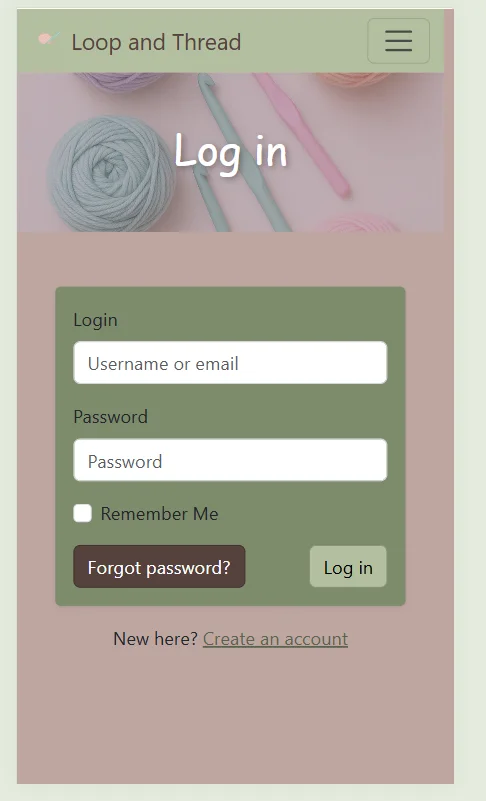

- Tablet

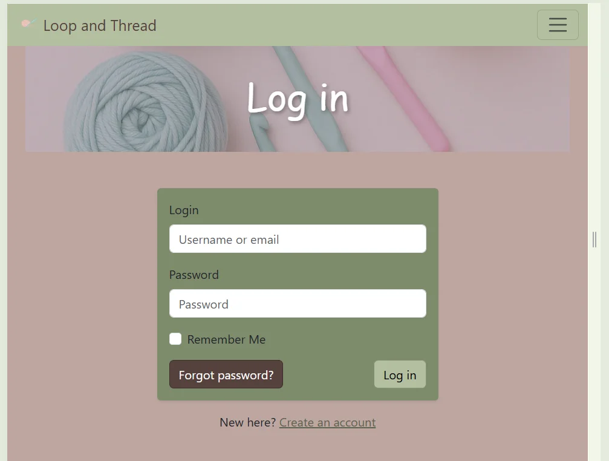

- Desktop

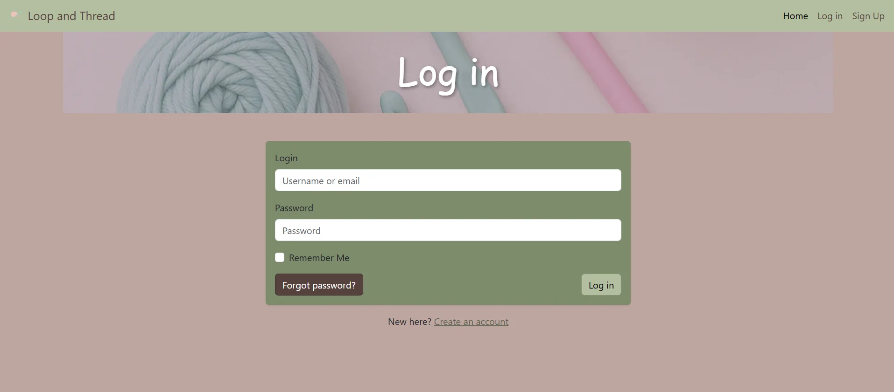

Sign up(mobile/tablet/desktop)

- Mobile

- Tablet

- Desktop

Account(mobile/tablet/desktop)

- Mobile

- Tablet

- Desktop

Add Pattern(mobile/tablet/desktop)

- Mobile

- Tablet

- Desktop

Edit Pattern(mobile/tablet/desktop)

- Mobile

- Tablet

- Desktop

Delete Pattern(mobile/tablet/desktop)

- Mobile

- Tablet

- Desktop

Add News(mobile/tablet/desktop)

- Mobile

- Tablet

- Desktop

Edit News(mobile/tablet/desktop)

- Mobile

- Tablet

- Desktop

Delete News(mobile/tablet/desktop)

- Mobile

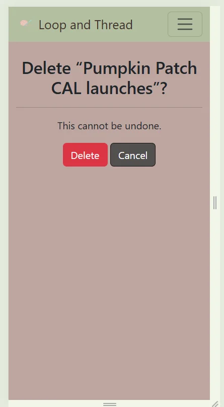

- Tablet

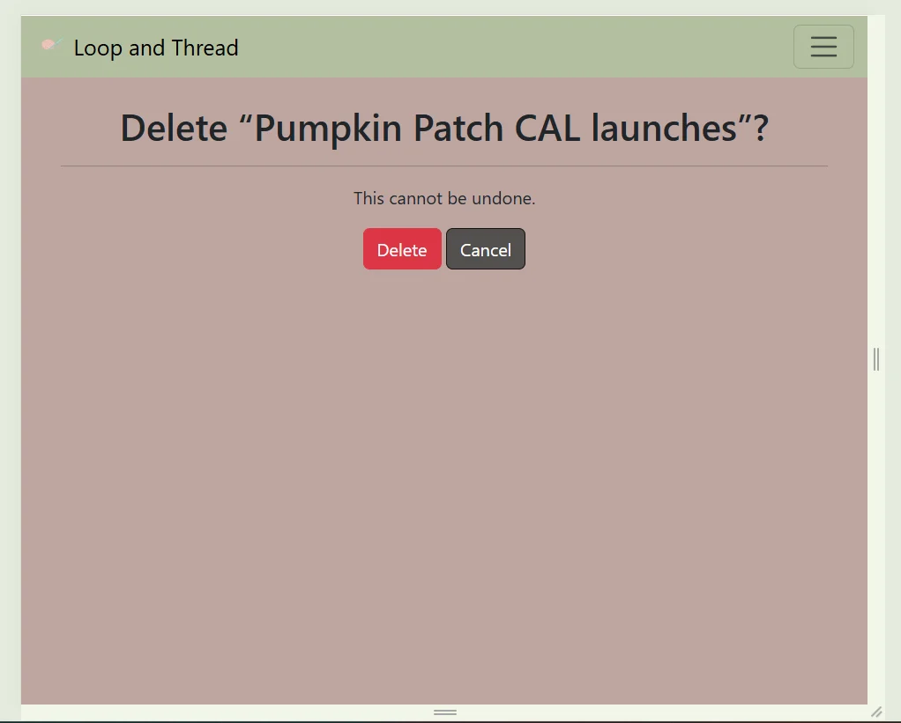

- Desktop

## Technologies Used
Technologies |
--- |
HTML |
CSS |
Bootstrap |
Github |
Django |
Python |
## Testing
TESTING! This will always be the core of my anxiety and I'm positive that I'm not the only one!   Let dive in....!
### Google's Lighthouse Performance
Screenshots of certain pages and scores (mobile and desktop)
### Browser Compatibility

#### Supported Browsers

Browsers | Status
--- | --- |
Google Chrome | &check; Fully Supported
Mozilla Firefox | &check; Fully Supported
Safari | &check; Fully Supported
Opera | &check; Fully Supported

Chrome

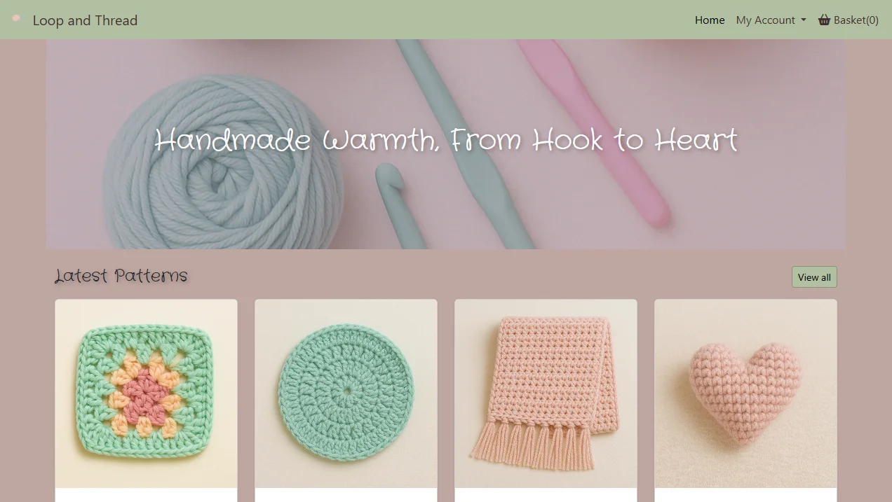

Safari

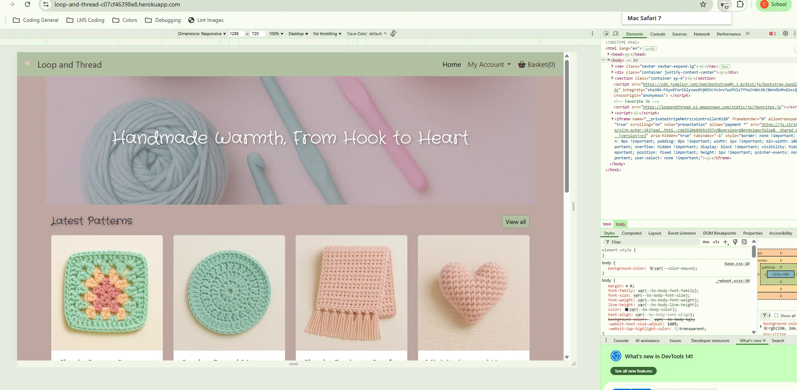

Firefox

Opera

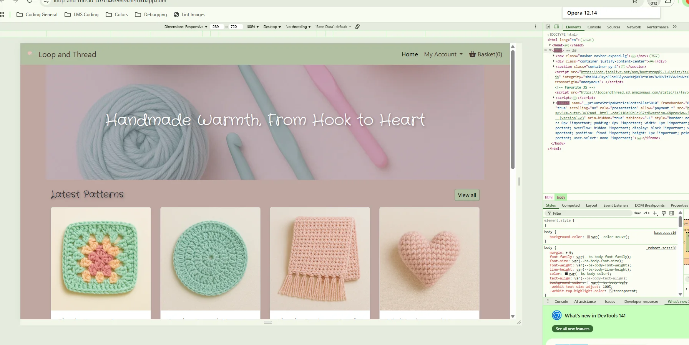

### Responsiveness
I've displayed the responsiveness of this site in my [user stories](userstories.md), head over to see them!

### Code Validation

#### HTML

Logged in(customer) home page

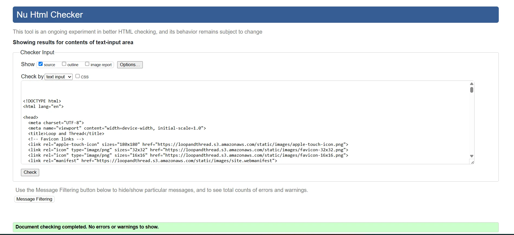

Logged out home page

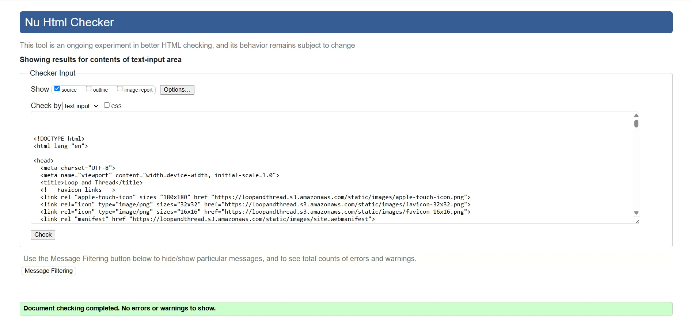

Logged in(owner) home page

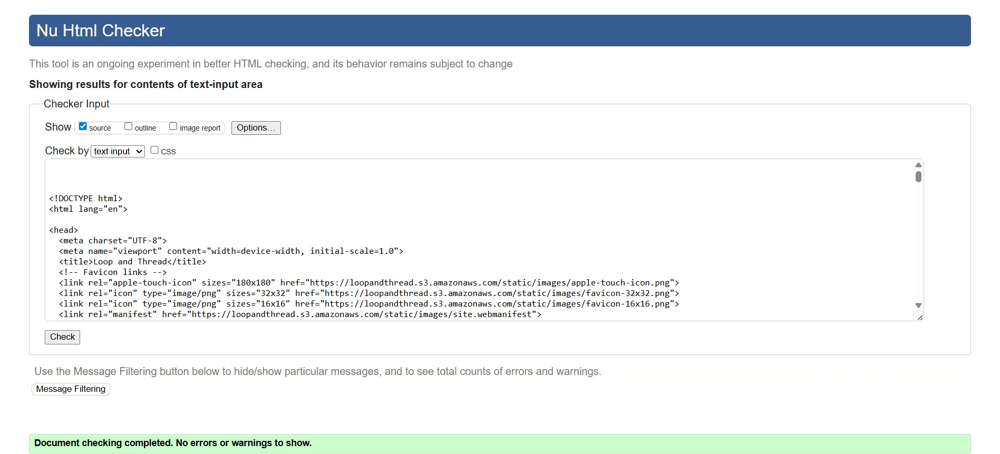

Log in page

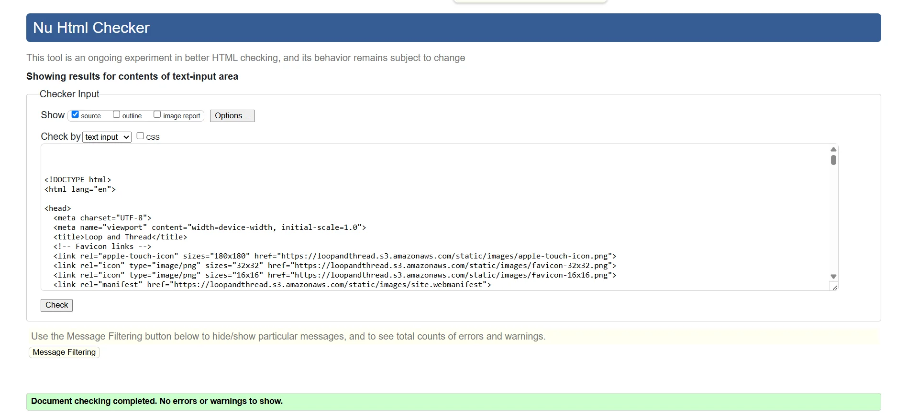

Log out page

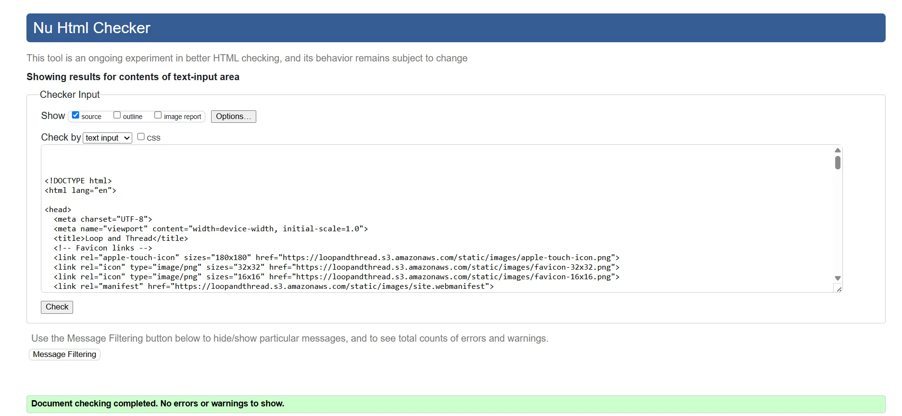

Sign up page

Pattern detail page

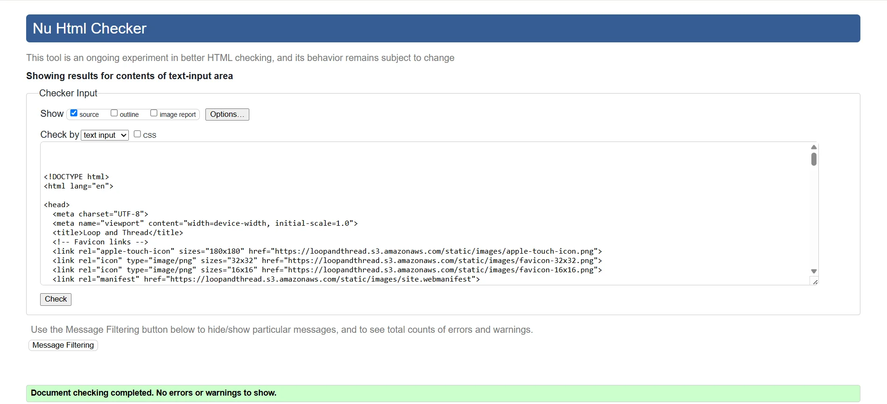

My account(customer)

Checkout page

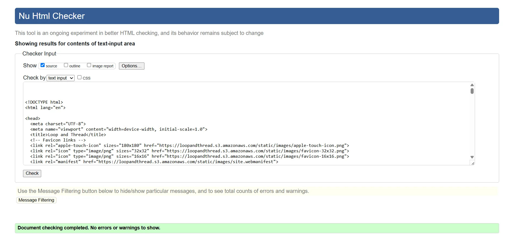

Checkout success page

Pattern Form

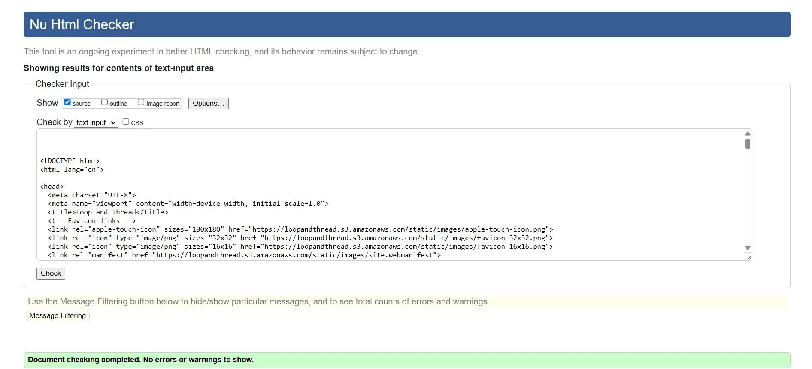

Pattern edit

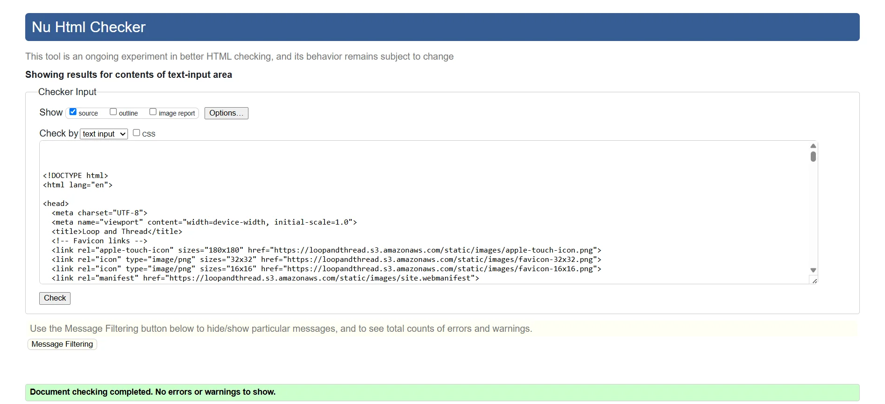

Manage Patterns

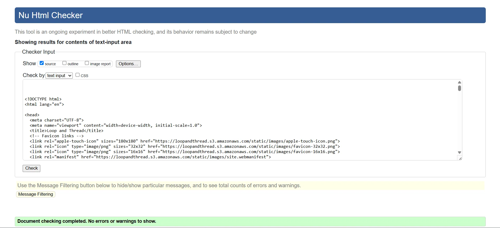

Pattern list

Pattern detail

Pattern confirm delete

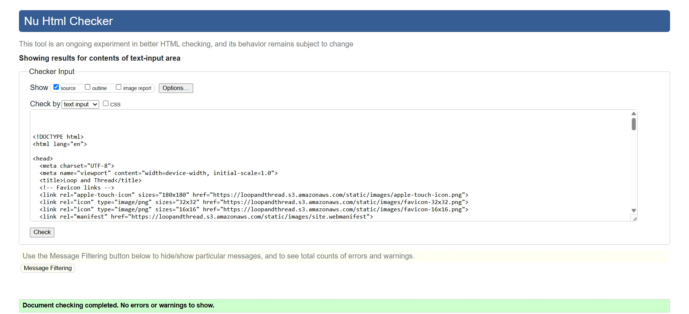

My favorites

Order details

Order list

Bag

News list

News form

Review Form

Review confirm delete

#### CSS

bag.css

checkout.css

news.css

pattern-details.css

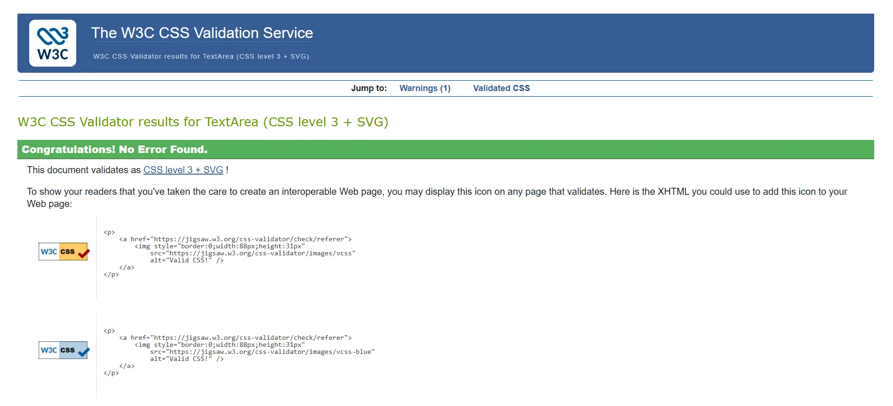

home.css

base.css

login.css

### CI Python Linter

Accounts

__init__.py

admin.py

apps.py

forms.py

models.py

signals.py

tests.py

urls.py

views.py

Bag

admin.py

__init__.py

apps.py

forms.py

models.py

contexts.py

tests.py

urls.py

views.py

Checkout

admin.py

__init__.py

apps.py

forms.py

models.py

signals.py

tests.py

urls.py

views.py

webhooks.py

webhook_handler.py

Patterns

__init__.py

admin.py

apps.py

models.py

tests.py

urls.py

views.py

Store

__init__.py

admin.py

apps.py

models.py

tests.py

urls.py

views.py

Loop and Thread

__init__.py

wsgi.py

asgi.py

urls.py

settings.py

Reviews

admin.py

__init__.py

apps.py

forms.py

models.py

tests.py

urls.py

views.py

News

admin.py

__init__.py

apps.py

forms.py

models.py

tests.py

urls.py

views.py

manage.py

custom_storages.py

### Manual Testing user stories or/and features
User Story Title | User Story |  Test | Pass
--- | --- | --- | :---:
Add Patterns | As the **owner**, I want **to add patterns** so that **they appear in the shop.** || &check;
Manage Profile | As a **user**, I want **to manage my profile** so that **checkout is faster.** ||&check;
Browse Home Page | As a **visitor**, I want **to view a home page** so that **I can quickly see featured patterns.** ||&check;
Browse All Patterns | As a **visitor**, I want **to browse all patterns** so that **I can explore options.** ||&check;
Mobile Menu (Burger + Drawer) | As a **mobile visitor**, I want **a collapsible menu** so that **I can navigate to key pages on small screens.** ||&check;
Checkout app | As a **shopper**, I want **to securely enter my details and pay for my order** so that **I can complete my purchase with confidence.** ||&check;
Keyword Search | As a **visitor**, I want **to search by keyword** so that **I can find patterns quickly.** ||&check;
Filter & Sort | As a **visitor**, I want **to filter and sort results** so that **I can narrow down choices.** ||&check;
Add to Cart | As a **visitor**, I want **to add patterns to a cart** so that **I can purchase them.** ||&check;
Primary Navigation(Desktop) | As a **visitor**, I want **to use a navigation menu** so that **I can access Shop, Categories, and Sign in/up easily.** ||&check;
Sign up page | As a **visitor**, I want **to sign up** so that **I can purchase and access downloads.** ||&check;
Log in page | As a **visitor**, I want **to log in** so that **I can purchase and access downloads.** ||&check;
Log out | As a **user**, I want **to sign out** so that **no-one can access my account**||&check;
Accessibility & Responsiveness | As a **visitor**, I want **the site to be accessible** so that **everyone can use it.**||&check;
Order History | As a **user**, I want **to see my past orders** so that **I can re-download purchased patterns.**||&check;
Security & Privacy | As the **owner**, I want **secure handling of payments and downloads** so that **user data is protected.**||&check;
Successful Checkout | As a **shopper**, I want **to complete a secure checkout and pay for my crochet pattern(s)** so that **I receive my order confirmation and access to my purchase.**||&check;
Delete Pattern | As the **owner**, I want **to be able to delete patterns** so that **I can remove patterns from the shop.**||&check;
Edit Pattern | As the **owner**, I want **to edit patterns** so that **they appear in the shop.**||&check;
Admin Dashboard | As the **owner**, I want **a dashboard** so that **I can manage catalogue.**||&check;
AWS | As a **developer**, I want **to integrate AWS S3 for media and static file storage** so that **images and static files are stored securely, efficiently, and served quickly from a reliable CDN.**||&check;
Deployment | As a **developer**, I want **to deploy my Django project to a live server** so that **users can access and use the application online.**||&check;
Pattern Categories | As the **owner**, I want **categories so that users can browse by type.**||&check;
Favorite Pattern | As a **registered user**, I want **to favorite a pattern so that I can quickly find and revisit the patterns I like.**||&check;
Unfavorite Pattern | As a **registered user**, I want **to favorite a pattern** so that **I can quickly find and revisit the patterns I like.**||&check;
Add News | As a **staff user**, I want **to create a news post** so that **I can share updates and announcements on the site.**||&check;
Edit News | As a **staff user**, I want **to edit an existing news post** so that **a staff user, I want to edit an existing news post so that I can correct errors or update information.**||&check;
Delete News | As a **staff user**, I want **to delete a news post** so that **I can remove outdated or incorrect announcements.**||&check;
Add a review | As a **customer who has purchased a pattern**, I want **to leave a rating and review** so that **other shoppers can trust real, verified feedback.**||&check;
Edit a review | As a registered user, I want to edit my review so that **I can correct mistakes or update my feedback after posting.**||&check;
Delete a review | As a **registered user**, I want **to delete my review** so that **I can remove feedback I no longer want to share.**||&check;

## Bugs

**TemplateDoesNotExist: `base.html`**  
  - *Cause*: The `base.html` file was not placed in the correct templates directory or not properly referenced.  
  - *Fix*: Created a `templates` folder at the project level, added `DIRS` in `settings.py`, and confirmed the correct template path.  

**Reverse URL error (`NoReverseMatch`)**  
  - *Cause*: Used `` without having the correct `app_name` or namespace defined in `urls.py`.  
  - *Fix*: Added `app_name = 'patterns'` in the app’s `urls.py` and updated all `` references.  

**Navbar logo not displaying**  
  - *Cause*: Incorrect path to static files.  
  - *Fix*: Confirmed logo placement inside `static/images/` and updated the template with ``.  

**Favicon not appearing in browser tab**  
  - *Cause*: Multiple favicon sizes weren’t properly referenced.  
  - *Fix*: Added all favicon sizes to `static/images/` and referenced them correctly in `base.html`.  

**Account migrations error (`table "account_emailaddress" already exists`)**  
  - *Cause*: Duplicate migrations from re-running `makemigrations` on the Allauth `account` app.  
  - *Fix*: Reset migration files and re-applied clean migrations.  

**CountryField error (`BlankChoiceIterator` object has no attribute `__len__`)**  
  - *Cause*: Incorrect field configuration for `CountryField`.  
  - *Fix*: Updated model to use `CountryField(blank_label="Country *", null=False, blank=False)`.  

**Hero image not centered**  
  - *Cause*: Background image CSS not set correctly.  
  - *Fix*: Used `background-position: center; background-size: cover;` in CSS.  

**Search bar border radius issue**  
  - *Cause*: Border radius only applied to one element (input vs. button).  
  - *Fix*: Grouped input + button inside a flex container and applied consistent border radius.  

**Pattern card images displaying different sizes**  
  - *Cause*: Uploaded images had inconsistent aspect ratios.  
  - *Fix*: Applied CSS with `aspect-ratio` and `object-fit: cover` for uniform card sizing.  

**Stripe Card Element not mounting**  
- *Cause*: Script used jQuery (`$`) to access keys, but jQuery was not included, causing a `ReferenceError`.  
- *Fix*: Added jQuery via CDN in `base.html`, ensuring `$` is defined and the Stripe Card Element mounts correctly.  

**Sign-up form submits but no user/redirect**
- *Cause*: Template didn’t render form errors; allauth set to production `(ACCOUNT_SIGNUP_EMAIL_ENTER_TWICE=True`, `ACCOUNT_EMAIL_VERIFICATION='mandatory')` blocked dev flow.
- *Fix*: Show `{{ form.errors }}` / `{{ form.non_field_errors }}` in `signup.html`. For dev, set `ACCOUNT_SIGNUP_EMAIL_ENTER_TWICE=False and ACCOUNT_EMAIL_VERIFICATION='none'`.

**Profile auto-creation failing on signup**
- *Cause*: Signal still created `Profile(default_user=instance)` after renaming field to `user`, causing `TypeError`.
- *Fix*: Use a single `post_save` receiver: `Profile.objects.get_or_create(user=instance)` in `accounts/signals.py`; load via `AccountsConfig.ready()`; ensure `INSTALLED_APPS` uses `accounts.apps.AccountsConfig`.

**Admin crash: `list_display` references old field**
- *Cause*: `accounts/admin.py` still used `default_user` in `list_display`.
- *Fix*: Update to `user`; for an email column use a helper (e.g., `def user_email(self, obj): return obj.user.email`).

**Checkout form not pre-populating**
- *Cause*: Built `initial` from `Profile` but didn’t pass it on GET; invalid POST redirected (lost bound data/errors).
- *Fix*: On GET use `OrderForm(initial=initial)`; on invalid POST re-render with `OrderForm(request.POST)` and show errors.

**NameError: name '`view`' is not defined in `patterns/urls.py`**
- *Cause*: Typo using `view.manage_patterns` instead of `views.manage_patterns`.
- *Fix*: Import `views` (plural) or import the functions directly and reference them correctly.

**Cover image not rendering in templates**
- *Cause*: Using a text container instead of ``; missing `.url`; media not served in dev.
- *Fix*: Use ``.

**Profile relation field mismatch**
- *Cause*: Model used `default_user` instead of standard user `OneToOneField`, breaking `request.user.profile` and admin filters.
- *Fix*: Rename field to `user = OneToOneField(User, related_name='profile', on_delete=models.CASCADE)` via migration; update references from `default_user` → `user`.

**NoReverseMatch on favourites toggle**
- *Cause*: URL tag received an empty id due to variable mismatch (`p.id`/`fav_ids`) and missing keyword arg.

- *Fix*: Use the correct loop var and pass pk as keyword: ``.

**Favorited heart not filling**
- *Cause*: Template checked `p.id in fav_ids` while context provided `favorite_ids`; also mixed `p` vs `pattern`.

- *Fix*: Standardise to `pattern.pk in favorite_ids` and ensure include passes `pattern=pattern`.

**Stripe “amount below minimum” error**
- *Cause*: Bag total was £0.00, so creating a PaymentIntent failed (below Stripe minimum).

- *Fix*: Add a free-order branch that skips Stripe when `total == 0` and completes order locally.

**Order() unexpected kwargs (`user`, `total`)**
- *Cause*: Used field names not present on `Order` model (`user`, `total`).

- *Fix*: Replace with actual fields (`user_profile`, `order_total` or `grand_total`) when creating the order.

**ValueError assigning User to `user_profile`**
- *Cause*: Assigned `request.user` (User) to `user_profile` (expects Profile).

- *Fix*: Fetch/create Profile and assign: `profile, _ = Profile.objects.get_or_create(user=request.user); order.user_profile = profile`.

**Muted/greyed code after free-order return**
- *Cause*: Early `return redirect(...)` made the linter flag following lines as unreachable; minor indentation added noise.

- *Fix*: Wrap paid flow in `else`: (or ensure a final `return render(...)`) and fix indentation so both paths are explicit.

## Deployment

#### Creating Repository on GitHub
- First make sure you are signed into [Github](https://github.com/) and go to the code institutes template, which can be found [here](https://github.com/Code-Institute-Org/gitpod-full-template).
- Then click on **use this template** and select **Create a new repository** from the drop-down. Enter the name for the repository and click **Create repository from template**.
- Once the repository was created, I clicked the green **gitpod** button to create a workspace in gitpod so that I could write the code for the site.
#### Deloying on Github
#### Creating Repository on GitHub
- First make sure you are signed into [Github](https://github.com/) and go to the code institutes template, which can be found [here](https://github.com/Code-Institute-Org/gitpod-full-template).

- Then click on **use this template** and select **Create a new repository** from the drop-down. Enter the name for the repository and click **Create repository from template**.

#### Deloying on Heroku
The site was deployed to Heroku using the following method:

##### Preparation
- Go to [Heroku](https://www.heroku.com/) (for me, Heroku Student) and sign in.

- Create a Heroku app with a **unique name**. Choose the correct region (e.g. Europe).

- In the app’s **Settings**, under **Config Vars**, add the keys(and your own values):  
  - DISABLE_COLLECTSTATIC
  - DATABASE_URL
  - CLOUDINARY_URL

- Install Gunicorn (your web server):  
  - pip install gunicorn~=20.1

- Freeze it into your requirements.txt: 
  - pip freeze > requirements.txt

- Create a Procfile in the root of your project and add: 
  - web: gunicorn your_project_name.wsgi  

Replace your_project_name with the name of the folder that contains settings.py.
- In settings.py:
  - Set DEBUG = False
  - Add your Heroku app to ALLOWED_HOSTS, e.g.:  
  ALLOWED_HOSTS = ['your-app-name.herokuapp.com']

- Save all changes and push your code to GitHub: 
  - git add .
  - git commit -m "Prepare for Heroku deployment"
  - git push

##### Ready to deploy
- In your Heroku app, go to the **Deploy** tab.

- Under **Deployment Method**, select **GitHub** and search for your repository.
- Connect the GitHub repo to the app.

- Scroll down to **Manual Deploy**, select the main branch and click **Deploy Branch**.

- Once complete, click “**Open App**” to view your live site.

- Voila! You can hit the Open app and there's your shiny new site in all it's glory.

## Credits
  - Code & Text Content
  I used most of these websites for help on several things!!
   - Crispy forms 
   - Django GitHub docs
   - Pixelied - PNG to WEBP Converter
   - Bootstrap docs
   - Google Fonts
   - FontAwesome
   - Favicon
   - ColorSpace
   - ChatGPT
   - Allauth
   - W3C HTML/CSS Validator
   - Heroku
   - Code Institute
   - W3Schools
   - StackOverflow
   - Stripe

  - Media    
    - YouTube
    - AWS
  
  - Acknowledgment
    - As usual with all my Code Institute projects:
      - My family have been absolutely amazing through this project, from my husband having the kids while I work to my kids being patient when waiting for 'mam time'. Thank you all so much, you really don't understand how much you've helped me through this course. I love you all loads!
      - A HUGE HUGE THANK YOU to Matt, my mentor. You've seen through my idiotic questions, chaotic life stories, banter and stupidity. I can't thank you enough for helping me through this course and project.
