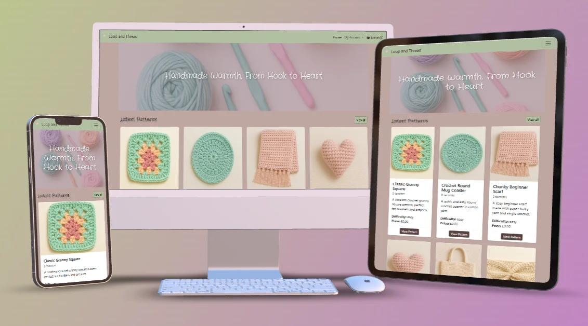
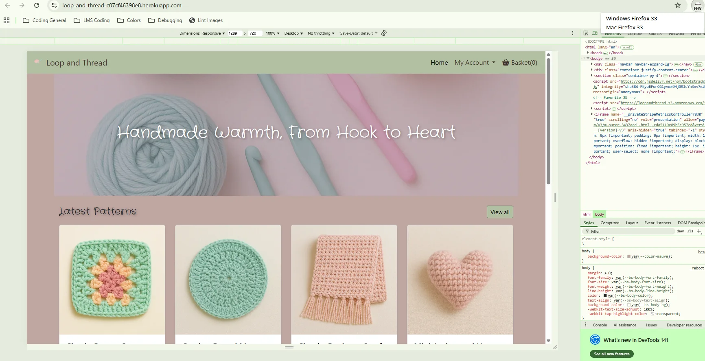
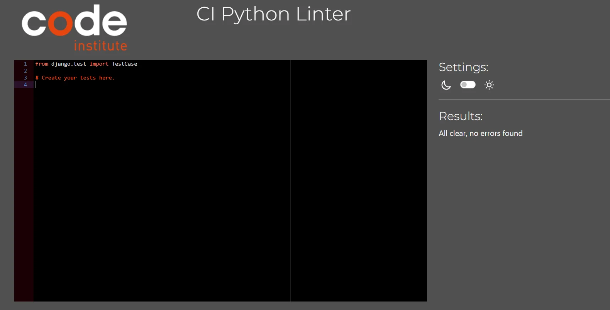
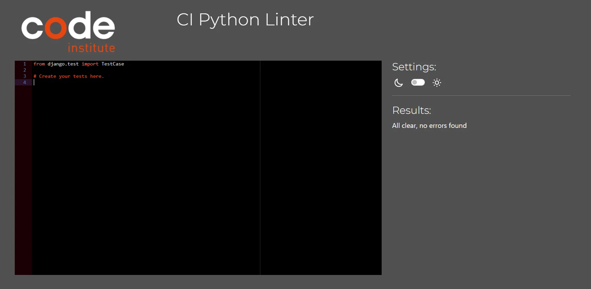
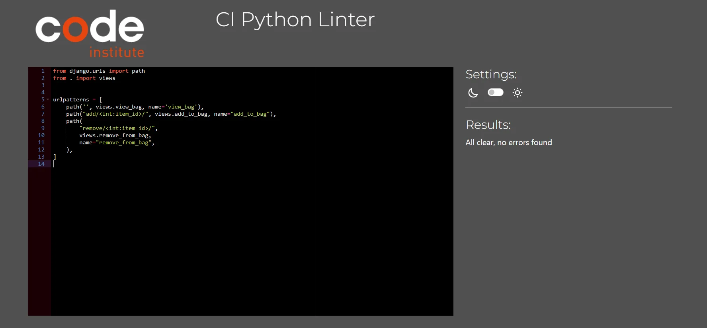
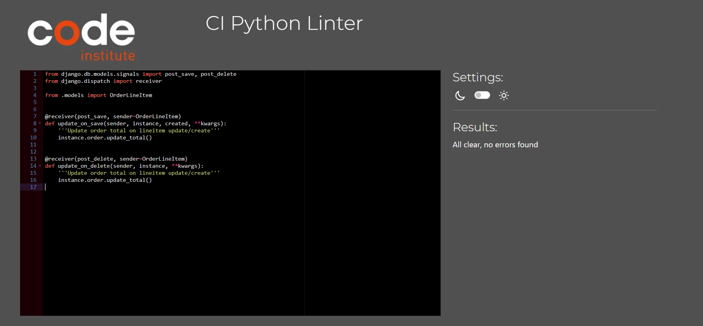
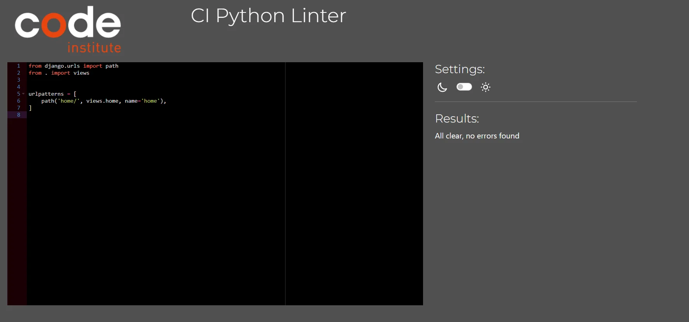

# Loop and Thread

 
**Loop & Thread** is a modern online crochet boutique offering premium digital crochet patterns, curated designs, and a personalised shopping experience for makers of every skill level.

Created for passionate crocheters who value high-quality patterns, clear instructions, and a supportive creative space, Loop & Thread aims to make pattern shopping effortless, enjoyable, and inspiring.

The platform is designed with both creativity and convenience in mind — allowing customers to browse beautiful patterns, purchase securely, store their orders, leave reviews, and return to their projects at any time.

With a clean interface, instant digital delivery, and a growing catalogue of designs, Loop & Thread strives to become a trusted home for crocheters looking for patterns that feel thoughtful, cosy, and truly handmade.

## Table Of Contents:
1. [Design & Planning](#design-and-planning)
    * [User Stories](#user-stories)
    * [Wireframes](#wireframes)
    * [Typography](#typography)
    * [Colour Scheme](#colour-scheme)
    * [UX Strategy](#ux-strategy)

    
2. [Features](#features)
    * [Navigation](#navigation)
    * [Other features](#other-features)

3. [Technologies Used](#technologies-used)
4. [Testing](#testing)
5. [Future Improvements](#future-improvements)
6. [Bugs](#bugs)
7. [Deployment](#deployment)
8. [Credits](#credits)

## Design and Planning:

### User Stories
[Here](userstories.md) you'll find the user stories for my project.

This page contains links to my user stories in my GitHub project and will have corresponding screenshots/screen recordings of the completed tasks.
### Wireframes
[Click here](wireframes.md) to view all the wireframes for this project.

### Typography
For this project I've gone for the Crafty Girl font from the Google Fonts site. I felt that this really fits the vibe of crocheting and allows for a relaxed but fun feel.

### Colour Scheme

I used the page's Eye Dropper extention to find a color that I could bounce off.

Eye Dropper screenshot

 

Then from that selection I used Colorspace to create a palette for my site.

Colorspace

- I went with this color scheme for a more classy look. My past project had a bonkers feel to them so I've tamed it down with this one. I wanted a cozy and comfy color pallet for this website as I feel that crocheting has that effect(on me anyways).

### ERD

The ERD below illustrates the core data models that power Loop & Thread, including their fields and the relationships between them. It shows how users connect to profiles, how patterns are categorized and purchased, and how orders, reviews, and news posts interact across the platform. This structure supports secure purchasing, verified-buyer reviews, and a scalable pattern catalogue.

ERD Chart

### UX Strategy

#### Strategy

- Product objectives:
Loop & Thread aims to provide a simple way for crochet lovers to discover, purchase, and download modern crochet patterns from one central, trusted place. The goal is to create a small but realistic e-commerce experience that could be managed by a solo maker.

- User needs:
The primary users are hobby crocheters who want clear, easy-to-follow patterns and a smooth way to buy and re-access them. They need to quickly find the right pattern for their skill level, pay securely, and be confident they can get back to their digital pattern later.

#### Scope

- Functional scope:

  The site will allow users to:
  - Browse and search crochet patterns.

  - View detailed information for each pattern.

  - Add/remove patterns from a shopping bag.

  - Checkout securely using Stripe.

  - Register and log in to manage their profile.

  - View order history and, where implemented, access digital patterns.

  - Favourite patterns and leave reviews as verified buyers.

  - Allow the site owner to manage patterns and orders via the admin panel.

- Content scope:

  The content includes:

  - Pattern information (title, image, description, difficulty, price, materials).

  - Supporting text such as help messages, toasts, and error feedback.

  - Legal/basic information such as brief terms, privacy or policy notes (if included).

  - Marketing copy (hero text, calls-to-action, button labels) that stays friendly and on-brand.

Keeping the scope clearly defined helps prevent “scope creep” and ensures the core user journeys (browse → select → purchase → access) are fully supported and tested.

#### Structure

- Information architecture:

  The site is organised around a small, logical set of pages:

  - Home

  - All Patterns / Category view

  - Pattern Detail

  - Bag

  - Checkout

  - Profile (including Order History)

  - Favorites

  - Login / Signup / Logout

  - Admin (for the owner)

- Key user flows:

  - Guest shopper: Home → Browse patterns → Pattern detail → Add to bag → Checkout → Order confirmation.

  - Returning customer: Login → Profile → View order history → (Revisit pattern details).

  - Engaged user: Login → Browse → Favourite some patterns → Purchase → Leave a review later.

The structure is deliberately simple and linear, reducing the number of clicks needed to move from interest to purchase while still giving users clear ways to navigate back.

#### Skeleton

  This is essentially your layout and navigation decisions.

  - Navigation:

    Global nav includes links to the main areas: Patterns, Favourites (when logged in), Account/Profile, and Bag. The bag icon shows the number of items, giving constant feedback.

- Layout patterns:

  - Consistent header and footer on all pages.

  - Catalogue pages use card grids to present patterns in a scannable way.

  - Forms (checkout, login, registration, profile) are centered with clear labels and validation messages.

  - Toast notifications appear at the top of the page to confirm success or highlight problems.

- Wireframe logic (even if informal):

  The skeleton follows a classic e-commerce layout: logo and nav at the top, main content in the centre, supporting actions (e.g. add to bag, edit, submit) clearly highlighted, and help text near form fields.

By keeping layouts predictable and consistent, users don’t have to relearn how to use the interface on each page, which reduces friction and errors.

#### Surface

  This is all about visual design and tone.

  - Colour palette:

    A soft, yarn-inspired palette (e.g. pastels) is used to reflect the cosy, handmade nature of crochet. Accent colours are reserved for primary actions like “Add to bag” or “Checkout”, making them stand out.

  - Typography:

    A clean, easy-to-read sans-serif font is used for body text, paired with a slightly more characterful font for headings to give the site a friendly personality without sacrificing legibility.

  - Imagery:

    Pattern images are central to the design. Clear product photos show the finished item so users can imagine the result. Decorative backgrounds and subtle textures support the cosy, handmade brand identity.

  - Tone of voice:

    Copy is encouraging, warm, and approachable – similar to how a friendly crochet tutor might speak. It avoids overly technical jargon and reassures users during payment and form submissions.

The surface layer brings the whole experience together so the site not only works well but also feels consistent with the cosy, crafted world of crochet.

## Features:
Here are the features for the website. Very minimal as I wanted to create a website that was easy to use and easy to look at.

 

Navigation

Navigation throughout Loop & Thread is designed to be simple, intuitive, and consistent across all devices.
The main navigation bar provides quick access to the Home page, the My Account section (for both customers and store owners), and the Basket, ensuring users can find what they need in just one click.

#### Key Features

- A clean, minimal design that complements the soft color palette of the site

- Smooth transition between desktop and mobile layouts

- Clearly labelled links and icons for effortless browsing

- The basket icon dynamically updates, giving a visual cue of items added

Mobile navigation

On smaller screens, navigation neatly condenses into a burger-menu in the top-right corner.
When tapped, it expands to reveal the full set of menu links in a soft drop-down panel, maintaining both clarity and style.

Desktop navigation

On larger screens, navigation is displayed across the top in a tidy horizontal layout, allowing instant access to all key areas without clutter.

### Other features

Single-Purchase Pattern Validation

To provide a smooth and logical shopping experience, each crochet pattern can only be purchased once per order. Because Loop & Thread patterns are digital downloads, allowing multiple copies of the same item in the bag would be unnecessary and potentially confusing at checkout.

##### How It Works

- When a customer clicks “Add to bag”, the app checks whether that pattern already exists in the session bag.

- If the same pattern is detected, the system prevents duplication and triggers a Bootstrap toast pop-up message that reads:

  - “You already have this in your bag.”

- If the pattern is not yet in the bag, it’s added successfully, followed by a green success toast confirming the addition.

##### Why It Matters

- Prevents users from accidentally purchasing the same pattern multiple times

- Keeps the bag and checkout process clean and accurate

- Improves overall user experience for digital products

##### Outcome:
Customers receive clear, instant feedback and can only ever purchase one copy of each digital pattern — ensuring a neat, intentional checkout flow.

### 1. Home Page

- Hero section introducing Loop & Thread with a clear value statement (e.g. “Handmade warmth, from hook to heart”).

- Featured patterns so users can immediately see popular or seasonal designs.

- Quick links to browse all patterns, view your account, or go straight to the bag.

The home page acts as a welcoming landing space that quickly tells new visitors what the site offers and gives returning customers shortcuts to where they most often want to go.

### 2. Pattern Catalogue (Store)

- Grid of all available crochet patterns with image, title, price, and difficulty.

- Category filter (e.g. blankets, toys, accessories) and search bar so users can quickly find relevant patterns.

- Pagination to keep the page fast and easy to scan.

The catalogue lets users scan a lot of products quickly, while filters and search reduce the effort needed to find a specific type of pattern.

### 3. Pattern Detail Page

- Large pattern image, full description, difficulty, materials needed, price.

- Clear call-to-action to add the pattern to the bag.

- Reviews and ratings from other customers (only available to verified buyers).

- If logged in, the user can add/remove the pattern from their favorites.

This page provides enough detail for the user to decide whether the pattern suits their skill level, budget, and yarn stash before committing to purchase.

### 4. Shopping Bag

- Summary of items added, including image, title, quantity, and line total.

- Ability to update quantities or remove items from the bag.

- Display of subtotal, any delivery (if applicable), and grand total.

- Button to proceed to secure checkout.

The bag gives users a clear overview of what they are about to buy and allows them to correct mistakes without friction, which is important for trust and conversion.

### 5. Secure Checkout (Stripe)

- Checkout form collecting name, email, and billing details.

- Stripe card element for secure card payments.

- Option for logged-in users to save their details to their profile for faster future checkouts.

- On success, the user is taken to an order confirmation page and a confirmation email is sent.

This feature provides a familiar and trusted payment flow using Stripe, reducing user anxiety about entering card details and ensuring payments are processed securely.

### 6. User Accounts & Profiles

- Users can register, log in, and log out using Django Allauth.

- A profile page shows saved delivery details and a list of previous orders.

- Logged-in users can easily re-download their purchased patterns (if you’ve set this up) or at least see what they’ve bought.

Profiles create a sense of ownership and continuity, allowing users to manage their details and revisit previous orders without having to track emails manually.

### 7. Favourites / Wishlist

- Logged-in users can favourite/unfavourite patterns from the pattern list or detail page.

- A dedicated Favourites page shows all saved patterns in one place.

This helps users keep track of patterns they love or want to buy later, encouraging return visits and future purchases.

### 8. Reviews & Ratings

- Only users who have purchased a pattern can leave a review.

- Reviews show rating, title, comment, and reviewer name/date.

- Pattern detail pages display an average rating and the list of reviews.

Verified-only reviews increase trust because users know feedback is from real customers who actually bought and used the pattern.

### 9. Admin & Store Management

- Site owner can add, edit, and delete patterns via the Django admin.

- Patterns can be assigned to categories, given prices, descriptions, and images.

- Admin can view orders to support customer queries if needed.

This supports the business side of the project, making it manageable for a solo owner to maintain the catalogue without touching the codebase.

### 10. Responsive Design, Error Pages & Toasts

- Fully responsive layout, tested on mobile, tablet, and desktop.

- Custom 400/403/404/500 pages that keep branding consistent and guide users back to safety.

- Toast messages to confirm actions (add to bag, update profile, form errors, etc.).

These features together improve the overall perceived quality of the site, supporting usability, accessibility and trust on all devices.

### 11. News Section

  - A dedicated page displaying all latest news posts in a clean, easy-to-scan list.

  - Each post includes a title, image, short summary, and a link to read the full article.

  - Individual news pages show the full content, image, and publish date.

  - Admins can easily add, edit, or delete news posts through the Django admin.

The news section keeps the site feeling active and up-to-date, giving users a place to read announcements, new pattern releases, and community updates. It encourages returning visits and supports the overall brand story of Loop & Thread.

## Technologies Used
Technologies |
--- |
HTML |
CSS |
Bootstrap |
Github |
Django |
Python |
## Testing
TESTING! This will always be the core of my anxiety and I'm positive that I'm not the only one!   Let dive in....!
### Google's Lighthouse Performance

#### Lighthouse Performance & Best Practices Note

The Lighthouse scores for Performance and Best Practices are slightly lower due to essential third-party services used in this project — Stripe for secure payments and AWS S3 for static/media delivery.

These external scripts and resource requests are outside of developer control and cannot be deferred or optimised further without breaking security or functionality.

All project-controlled assets (CSS, JS, images) are already compressed and optimised, and the site performs smoothly in real-world use. The score impact is therefore expected when relying on secure payment processing and cloud storage.

Best practice score

Home page Lighthouse score

Pattern list Lighthouse score

Pattern detail Lighthouse score

### Browser Compatibility

#### Supported Browsers

Browsers | Status
--- | --- |
Google Chrome | &check; Fully Supported
Mozilla Firefox | &check; Fully Supported
Safari | &check; Fully Supported
Opera | &check; Fully Supported

Chrome

Safari

Firefox

Opera

### Responsiveness
I've displayed the responsiveness of this site in my [user stories](userstories.md), head over to see them!

### Code Validation

#### HTML

Logged in(customer) home page

Logged out home page

[Logged out home page](https://validator.w3.org/nu/?doc=https%3A%2F%2Floop-and-thread-c07cf46398e8.herokuapp.com%2F)

Logged in(owner) home page

Log in page

[Log in page](https://validator.w3.org/nu/?doc=https%3A%2F%2Floop-and-thread-c07cf46398e8.herokuapp.com%2Faccounts%2Flogin%2F)

Log out page

Sign up page

[Sign up page](https://validator.w3.org/nu/?doc=https%3A%2F%2Floop-and-thread-c07cf46398e8.herokuapp.com%2Faccounts%2Fsignup%2F)

Pattern detail page

[Pattern detail page](https://validator.w3.org/nu/?doc=https%3A%2F%2Floop-and-thread-c07cf46398e8.herokuapp.com%2Fpatterns%2F4%2F)

My account(customer)

Checkout page

Checkout success page

Pattern Form

Pattern edit

Manage Patterns

Pattern list

Pattern detail

Pattern confirm delete

My favorites

Order details

Order list

Bag

[Bag](https://validator.w3.org/nu/?doc=https%3A%2F%2Floop-and-thread-c07cf46398e8.herokuapp.com%2Fbag%2F)

News list

News form

Review Form

Review confirm delete

#### CSS

bag.css

checkout.css

news.css

pattern-details.css

home.css

base.css

login.css

### CI Python Linter

Accounts

__init__.py

Nothing there to test

admin.py

apps.py

forms.py

models.py

signals.py

tests.py

urls.py

views.py

Bag

admin.py

__init__.py

Nothing there to test

apps.py

models.py

contexts.py

tests.py

urls.py

views.py

Checkout

admin.py

__init__.py

apps.py

forms.py

models.py

signals.py

tests.py

urls.py

views.py

webhooks.py

webhook_handler.py

Patterns

__init__.py

Nothing to test

admin.py

apps.py

models.py

tests.py

urls.py

views.py

Store

__init__.py

Nothing to test here

admin.py

apps.py

models.py

tests.py

urls.py

views.py

Loop and Thread

__init__.py

Nothing to test here

wsgi.py

asgi.py

urls.py

settings.py

Reviews

admin.py

__init__.py

Nothing to test here

apps.py

forms.py

models.py

tests.py

urls.py

views.py

News

admin.py

__init__.py

Nothing to test here

apps.py

models.py

tests.py

urls.py

views.py

manage.py

custom_storages.py

### Manual Testing user stories or/and features
User Story Title | User Story | Pass
--- | --- | :---:
Add Patterns | As the **owner**, I want **to add patterns** so that **they appear in the shop.** | &check;
Manage Profile | As a **user**, I want **to manage my profile** so that **checkout is faster.** |&check;
Browse Home Page | As a **visitor**, I want **to view a home page** so that **I can quickly see featured patterns.** |&check;
Browse All Patterns | As a **visitor**, I want **to browse all patterns** so that **I can explore options.** |&check;
Mobile Menu (Burger + Drawer) | As a **mobile visitor**, I want **a collapsible menu** so that **I can navigate to key pages on small screens.** |&check;
Checkout app | As a **shopper**, I want **to securely enter my details and pay for my order** so that **I can complete my purchase with confidence.** |&check;
Keyword Search | As a **visitor**, I want **to search by keyword** so that **I can find patterns quickly.** |&check;
Filter & Sort | As a **visitor**, I want **to filter and sort results** so that **I can narrow down choices.** |&check;
Add to Cart | As a **visitor**, I want **to add patterns to a cart** so that **I can purchase them.** |&check;
Primary Navigation(Desktop) | As a **visitor**, I want **to use a navigation menu** so that **I can access Shop, Categories, and Sign in/up easily.** |&check;
Sign up page | As a **visitor**, I want **to sign up** so that **I can purchase and access downloads.** |&check;
Log in page | As a **visitor**, I want **to log in** so that **I can purchase and access downloads.** |&check;
Log out | As a **user**, I want **to sign out** so that **no-one can access my account**|&check;
Accessibility & Responsiveness | As a **visitor**, I want **the site to be accessible** so that **everyone can use it.**|&check;
Order History | As a **user**, I want **to see my past orders** so that **I can re-download purchased patterns.**|&check;
Security & Privacy | As the **owner**, I want **secure handling of payments and downloads** so that **user data is protected.**|&check;
Successful Checkout | As a **shopper**, I want **to complete a secure checkout and pay for my crochet pattern(s)** so that **I receive my order confirmation and access to my purchase.**|&check;
Delete Pattern | As the **owner**, I want **to be able to delete patterns** so that **I can remove patterns from the shop.**|&check;
Edit Pattern | As the **owner**, I want **to edit patterns** so that **they appear in the shop.**|&check;
Admin Dashboard | As the **owner**, I want **a dashboard** so that **I can manage catalogue.**|&check;
AWS | As a **developer**, I want **to integrate AWS S3 for media and static file storage** so that **images and static files are stored securely, efficiently, and served quickly from a reliable CDN.**|&check;
Deployment | As a **developer**, I want **to deploy my Django project to a live server** so that **users can access and use the application online.**|&check;
Pattern Categories | As the **owner**, I want **categories so that users can browse by type.**|&check;
Favorite Pattern | As a **registered user**, I want **to favorite a pattern so that I can quickly find and revisit the patterns I like.**|&check;
Unfavorite Pattern | As a **registered user**, I want **to favorite a pattern** so that **I can quickly find and revisit the patterns I like.**|&check;
Add News | As a **staff user**, I want **to create a news post** so that **I can share updates and announcements on the site.**|&check;
Edit News | As a **staff user**, I want **to edit an existing news post** so that **a staff user, I want to edit an existing news post so that I can correct errors or update information.**|&check;
Delete News | As a **staff user**, I want **to delete a news post** so that **I can remove outdated or incorrect announcements.**|&check;
Add a review | As a **customer who has purchased a pattern**, I want **to leave a rating and review** so that **other shoppers can trust real, verified feedback.**|&check;
Edit a review | As a registered user, I want to edit my review so that **I can correct mistakes or update my feedback after posting.**|&check;
Delete a review | As a **registered user**, I want **to delete my review** so that **I can remove feedback I no longer want to share.**|&check;

### Automated Testing

✅ Automated Testing

Automated tests were created using Django’s built-in test framework.

Each app has at least one view test, checking that key pages load correctly and return the expected template.
Restricted pages (like reviews) were also tested to ensure only logged-in users can access them. 

Run tests:

python manage.py test

All tests passed successfully.

#### Testing Summary
App / Feature |	Test Type |	Description |	Status
-- | -- | -- | -- |
Bag |	View Test |	Confirms that the bag page loads and the correct template renders. |	✅ Passed
Patterns |	View Test |	Confirms that the patterns page renders successfully. |	✅ Passed
News |	View Test |	Confirms that the news list page loads correctly. |	✅ Passed
Checkout |	View Test	| Confirms that the checkout page renders when items exist in the bag. |	✅ Passed
Accounts (Authentication) |	View Test |	Checks that /accounts/ redirects unauthenticated users (login required). |	✅ Passed
Reviews |	View Access | Test	Ensures anonymous users cannot access review creation and are redirected. |	✅ Passed

#### Test Results Screenshot

Test Command |	Result | Screenshot
-- | -- | -- |
python manage.py accounts |	✅ All tests passed | 
python manage.py bag |	✅ All tests passed | 
python manage.py checkout |	✅ All tests passed | 
python manage.py news |	✅ All tests passed | 
python manage.py patterns |	✅ All tests passed | 
python manage.py reviews |	✅ All tests passed | 

## Future Improvements
As Loop and Thread continues to grow, there are several exciting features planned to enhance usability, community interaction, and customer satisfaction. A key focus will be on **digital delivery**, allowing buyers to easily access and re-download their purchased crochet patterns through their account dashboard, as well as receive secure **download links via email** for future reference.

Building on this, the next phase will expand the site’s **social feedback** features — enabling users to **leave detailed reviews** to help others make informed choices, and to **favorite patterns** for quick access later.

Finally, a **wishlist system** will be introduced, allowing registered users to **save patterns** they love, **compare items**, and **add them directly to their bag** when they’re ready to purchase. Together, these improvements aim to make Loop and Thread an even more personal, convenient, and inspiring experience for every crocheter.

## Bugs

**TemplateDoesNotExist: `base.html`**  
  - *Cause*: The `base.html` file was not placed in the correct templates directory or not properly referenced.  
  - *Fix*: Created a `templates` folder at the project level, added `DIRS` in `settings.py`, and confirmed the correct template path.  

**Reverse URL error (`NoReverseMatch`)**  
  - *Cause*: Used `` without having the correct `app_name` or namespace defined in `urls.py`.  
  - *Fix*: Added `app_name = 'patterns'` in the app’s `urls.py` and updated all `` references.  

**Navbar logo not displaying**  
  - *Cause*: Incorrect path to static files.  
  - *Fix*: Confirmed logo placement inside `static/images/` and updated the template with ``.  

**Favicon not appearing in browser tab**  
  - *Cause*: Multiple favicon sizes weren’t properly referenced.  
  - *Fix*: Added all favicon sizes to `static/images/` and referenced them correctly in `base.html`.  

**Account migrations error (`table "account_emailaddress" already exists`)**  
  - *Cause*: Duplicate migrations from re-running `makemigrations` on the Allauth `account` app.  
  - *Fix*: Reset migration files and re-applied clean migrations.  

**CountryField error (`BlankChoiceIterator` object has no attribute `__len__`)**  
  - *Cause*: Incorrect field configuration for `CountryField`.  
  - *Fix*: Updated model to use `CountryField(blank_label="Country *", null=False, blank=False)`.  

**Hero image not centered**  
  - *Cause*: Background image CSS not set correctly.  
  - *Fix*: Used `background-position: center; background-size: cover;` in CSS.  

**Search bar border radius issue**  
  - *Cause*: Border radius only applied to one element (input vs. button).  
  - *Fix*: Grouped input + button inside a flex container and applied consistent border radius.  

**Pattern card images displaying different sizes**  
  - *Cause*: Uploaded images had inconsistent aspect ratios.  
  - *Fix*: Applied CSS with `aspect-ratio` and `object-fit: cover` for uniform card sizing.  

**Stripe Card Element not mounting**  
- *Cause*: Script used jQuery (`$`) to access keys, but jQuery was not included, causing a `ReferenceError`.  
- *Fix*: Added jQuery via CDN in `base.html`, ensuring `$` is defined and the Stripe Card Element mounts correctly.  

**Sign-up form submits but no user/redirect**
- *Cause*: Template didn’t render form errors; allauth set to production `(ACCOUNT_SIGNUP_EMAIL_ENTER_TWICE=True`, `ACCOUNT_EMAIL_VERIFICATION='mandatory')` blocked dev flow.
- *Fix*: Show `{{ form.errors }}` / `{{ form.non_field_errors }}` in `signup.html`. For dev, set `ACCOUNT_SIGNUP_EMAIL_ENTER_TWICE=False and ACCOUNT_EMAIL_VERIFICATION='none'`.

**Profile auto-creation failing on signup**
- *Cause*: Signal still created `Profile(default_user=instance)` after renaming field to `user`, causing `TypeError`.
- *Fix*: Use a single `post_save` receiver: `Profile.objects.get_or_create(user=instance)` in `accounts/signals.py`; load via `AccountsConfig.ready()`; ensure `INSTALLED_APPS` uses `accounts.apps.AccountsConfig`.

**Admin crash: `list_display` references old field**
- *Cause*: `accounts/admin.py` still used `default_user` in `list_display`.
- *Fix*: Update to `user`; for an email column use a helper (e.g., `def user_email(self, obj): return obj.user.email`).

**Checkout form not pre-populating**
- *Cause*: Built `initial` from `Profile` but didn’t pass it on GET; invalid POST redirected (lost bound data/errors).
- *Fix*: On GET use `OrderForm(initial=initial)`; on invalid POST re-render with `OrderForm(request.POST)` and show errors.

**NameError: name '`view`' is not defined in `patterns/urls.py`**
- *Cause*: Typo using `view.manage_patterns` instead of `views.manage_patterns`.
- *Fix*: Import `views` (plural) or import the functions directly and reference them correctly.

**Cover image not rendering in templates**
- *Cause*: Using a text container instead of ``; missing `.url`; media not served in dev.
- *Fix*: Use ``.

**Profile relation field mismatch**
- *Cause*: Model used `default_user` instead of standard user `OneToOneField`, breaking `request.user.profile` and admin filters.
- *Fix*: Rename field to `user = OneToOneField(User, related_name='profile', on_delete=models.CASCADE)` via migration; update references from `default_user` → `user`.

**NoReverseMatch on favourites toggle**
- *Cause*: URL tag received an empty id due to variable mismatch (`p.id`/`fav_ids`) and missing keyword arg.

- *Fix*: Use the correct loop var and pass pk as keyword: ``.

**Favorited heart not filling**
- *Cause*: Template checked `p.id in fav_ids` while context provided `favorite_ids`; also mixed `p` vs `pattern`.

- *Fix*: Standardise to `pattern.pk in favorite_ids` and ensure include passes `pattern=pattern`.

**Stripe “amount below minimum” error**
- *Cause*: Bag total was £0.00, so creating a PaymentIntent failed (below Stripe minimum).

- *Fix*: Add a free-order branch that skips Stripe when `total == 0` and completes order locally.

**Order() unexpected kwargs (`user`, `total`)**
- *Cause*: Used field names not present on `Order` model (`user`, `total`).

- *Fix*: Replace with actual fields (`user_profile`, `order_total` or `grand_total`) when creating the order.

**ValueError assigning User to `user_profile`**
- *Cause*: Assigned `request.user` (User) to `user_profile` (expects Profile).

- *Fix*: Fetch/create Profile and assign: `profile, _ = Profile.objects.get_or_create(user=request.user); order.user_profile = profile`.

**Muted/greyed code after free-order return**
- *Cause*: Early `return redirect(...)` made the linter flag following lines as unreachable; minor indentation added noise.

- *Fix*: Wrap paid flow in `else`: (or ensure a final `return render(...)`) and fix indentation so both paths are explicit.

## Deployment

### Deloying on Heroku
The site was deployed to Heroku using the following method:

#### Preparation
- Go to [Heroku](https://www.heroku.com/) (for me, Heroku Student) and sign in.

- Create a Heroku app with a **unique name**. Choose the correct region (e.g. Europe).

- In the app’s **Settings**, under **Config Vars**, add the keys(and your own values):  
  - DISABLE_COLLECTSTATIC
  - DATABASE_URL
  - CLOUDINARY_URL

- Install Gunicorn (your web server):  
  - pip install gunicorn~=20.1

- Freeze it into your requirements.txt: 
  - pip freeze > requirements.txt

- Create a Procfile in the root of your project and add: 
  - web: gunicorn your_project_name.wsgi  

Replace your_project_name with the name of the folder that contains settings.py.
- In settings.py:
  - Set DEBUG = False
  - Add your Heroku app to ALLOWED_HOSTS, e.g.:  
  ALLOWED_HOSTS = ['your-app-name.herokuapp.com']

- Save all changes and push your code to GitHub: 
  - git add .
  - git commit -m "Prepare for Heroku deployment"
  - git push

##### Ready to deploy
- In your Heroku app, go to the **Deploy** tab.

- Under **Deployment Method**, select **GitHub** and search for your repository.
- Connect the GitHub repo to the app.

- Scroll down to **Manual Deploy**, select the main branch and click **Deploy Branch**.

- Once complete, click “**Open App**” to view your live site.

- Voila! You can hit the Open app and there's your shiny new site in all it's glory.

## Credits
  - Code & Text Content
    
    I used most of these websites for help on several things!! It's crazy to see that others have the same issues and way on thinking.
   - Crispy forms 
   - Django GitHub docs
   - Pixelied - PNG to WEBP Converter
   - Bootstrap docs
   - Google Fonts
   - FontAwesome
   - Favicon
   - ColorSpace
   - ChatGPT
   - Allauth
   - W3C HTML/CSS Validator
   - Heroku
   - Code Institute - For the GitHub template and walkthroughs(saved my life on many occasions!)
   - W3Schools
   - StackOverflow
   - Stripe
   - CI Python Linter
   - Device Frames - For the hero image in the README.

  - Media    
    - YouTube
    - AWS
  
  - Acknowledgment
    - As usual with all my Code Institute projects:
      - My family have been absolutely amazing through this project, from my husband having the kids while I work to my kids being patient when waiting for 'mam time'. Thank you all so much, you really don't understand how much you've helped me through this course. I love you all loads!
      - A HUGE HUGE THANK YOU to Matt, my mentor. You've seen through my idiotic questions, chaotic life stories, banter and stupidity. I can't thank you enough for helping me through this course and project.
