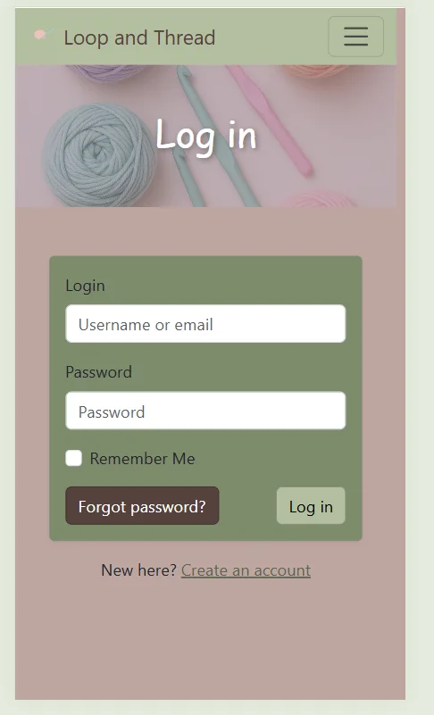
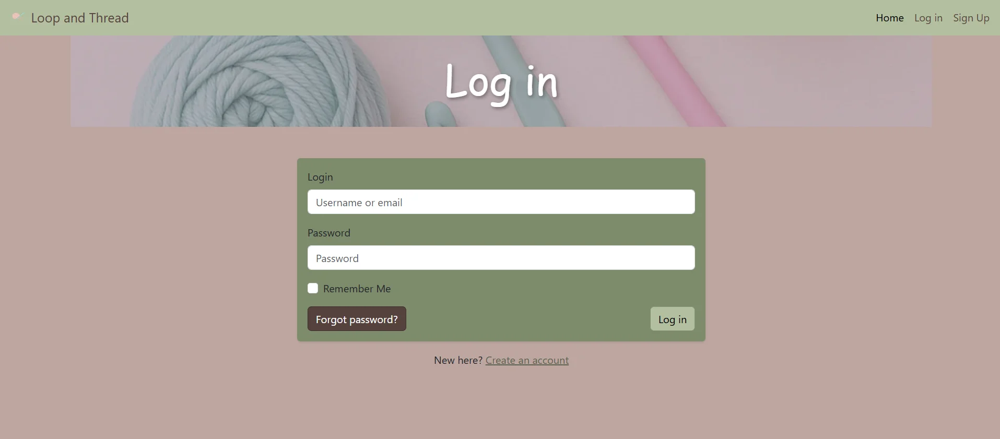
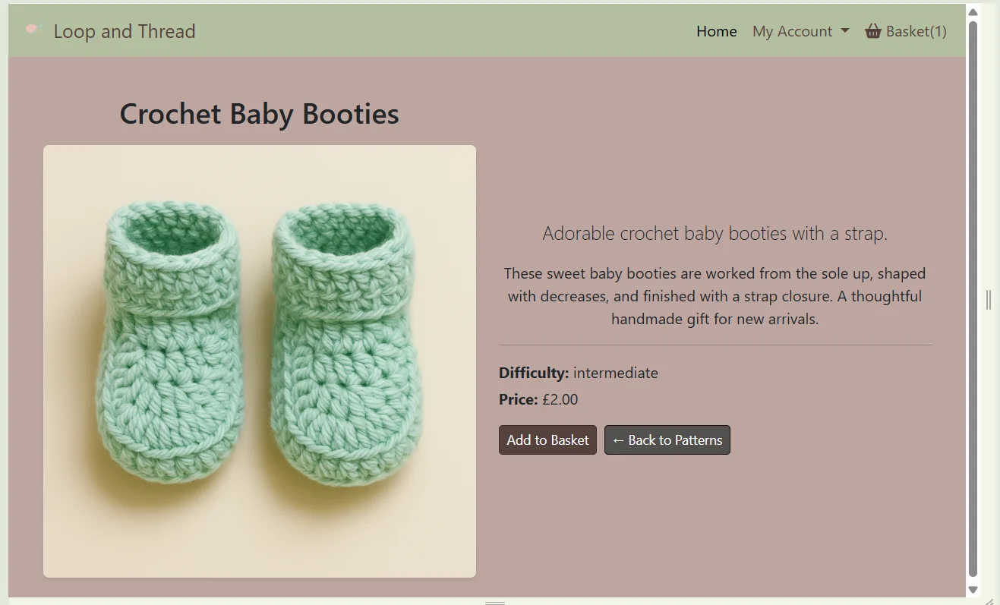

# User Stories
This section showcases the full journey of my project’s development, guided by Agile principles. Each user story represents a real feature or enhancement that shaped the final product — from initial ideas and planning through to completed functionality. Below you’ll find a combination of videos and screenshots that demonstrate how each story was implemented, tested, and refined to meet user needs and project goals.

## Epic 1 - Navigation

User Story | Link to GitHub | Screenshot/Video of User Story
--- | --- | ---
As a visitor, I want to browse all patterns so that I can explore options. | https://github.com/chloejones9464/loop-and-thread/issues/11 |   

## Epic 2 - Accounts
User Story | Link to GitHub | Screenshot/Video of User Story
--- | --- | ---
As a visitor, I want to log in so that I can purchase and access downloads. | https://github.com/chloejones9464/loop-and-thread/issues/33 |   
As a user I want to sign out so that no-one can access my account | https://github.com/chloejones9464/loop-and-thread/issues/34 |   
As a visitor, I want to sign up so that I can purchase and access downloads. | https://github.com/chloejones9464/loop-and-thread/issues/32 |  

## Epic 3 - Catalogue Management
User Story | Link to GitHub | Screenshot/Video of User Story
--- | --- | ---
As the owner, I want to be able to delete patterns so that i can remove patterns from the shop. | https://github.com/chloejones9464/loop-and-thread/issues/36 |  
As the owner, I want to edit patterns so that they appear in the shop. | https://github.com/chloejones9464/loop-and-thread/issues/35 |  Add/edit/delete functionality 
As the owner, I want to add patterns so that they appear in the shop. | https://github.com/chloejones9464/loop-and-thread/issues/14 |  

## Epic 4 - Search, filter & sort
User Story | Link to GitHub | Screenshot/Video of User Story
--- | --- | ---
As a visitor, I want to filter and sort results so that I can narrow down choices. | https://github.com/chloejones9464/loop-and-thread/issues/17 |   
As a visitor, I want to search by keyword so that I can find patterns quickly. | https://github.com/chloejones9464/loop-and-thread/issues/16 |    

## Epic 5 - Cart & Checkout
User Story | Link to GitHub | Screenshot/Video of User Story
--- | --- | ---
As a visitor, I want to add patterns to a cart so that I can purchase them. | https://github.com/chloejones9464/loop-and-thread/issues/18 |   

## Epic 6 - Digital Delivery(future improvements)
User Story | Link to GitHub | Screenshot/Video of User Story
--- | --- | ---
As a buyer, I want access to my purchased PDFs so that I can download them anytime. | https://github.com/chloejones9464/loop-and-thread/issues/20 |
As a buyer, I want to receive download links in email so that I can access them later. | https://github.com/chloejones9464/loop-and-thread/issues/21 |

## Epic 7 - Social Feedback(future improvements)
User Story | Link to GitHub | Screenshot/Video of User Story
--- | --- | ---
As a buyer, I want to leave reviews so that others can make informed choices. | https://github.com/chloejones9464/loop-and-thread/issues/23 |
As a user, I want to favourite patterns so that I can find them later. | https://github.com/chloejones9464/loop-and-thread/issues/22 |

## Epic 8 - Orders
User Story | Link to GitHub | Screenshot/Video of User Story
--- | --- | ---
As a user, I want to see my past orders so that I can re-download purchased patterns. | https://github.com/chloejones9464/loop-and-thread/issues/24 | 

## Epic 9 - Testing for README
User Story | Link to GitHub | Screenshot/Video of User Story
--- | --- | ---
As a visitor, I want the site to be accessible so that everyone can use it. | https://github.com/chloejones9464/loop-and-thread/issues/26 | 
As the owner, I want secure handling of payments and downloads so that user data is protected. | https://github.com/chloejones9464/loop-and-thread/issues/27 | 

## Epic 10 - Browsing
User Story | Link to GitHub | Screenshot/Video of User Story
--- | --- | ---
As a visitor, I want to view a home page so that I can quickly see featured patterns. | https://github.com/chloejones9464/loop-and-thread/issues/10 |    

## Epic 11 - Profiles
User Story | Link to GitHub | Screenshot/Video of User Story
--- | --- | ---
As a user, I want to manage my profile so that checkout is faster. | https://github.com/chloejones9464/loop-and-thread/issues/13 |   

## Epic 12 - Admin
User Story | Link to GitHub | Screenshot/Video of User Story
--- | --- | ---
As the owner, I want a dashboard so that I can manage catalogue. | https://github.com/chloejones9464/loop-and-thread/issues/25 | [Catalogue Management link](#epic-3---catalogue-management)

## Epic 13 - Checkout
User Story | Link to GitHub | Screenshot/Video of User Story
--- | --- | ---
As a shopper, I want to securely enter my details and pay for my order so that I can complete my purchase with confidence. | https://github.com/chloejones9464/loop-and-thread/issues/39 |   
As a shopper, I want to complete a secure checkout and pay for my crochet pattern(s) so that I receive my order confirmation and access to my purchase. | https://github.com/chloejones9464/loop-and-thread/issues/40 |  

## Epic 14 - Favourite patterns
User Story | Link to GitHub | Screenshot/Video of User Story
--- | --- | ---
As a registered user, I want to favourite a pattern so that I can quickly find and revisit the patterns I like. | https://github.com/chloejones9464/loop-and-thread/issues/49 |   ! 
As a registered user, I want to remove a pattern from my favourites so that my saved list stays relevant and clutter-free. | https://github.com/chloejones9464/loop-and-thread/issues/50 |  

## Epic 15 - Leave Review
User Story | Link to GitHub | Screenshot/Video of User Story
--- | --- | ---
As a customer who has purchased a pattern, I want to leave a rating and review so that other shoppers can trust real, verified feedback. | https://github.com/chloejones9464/loop-and-thread/issues/23 |  
As a registered user, I want to edit my review so that I can correct mistakes or update my feedback after posting. | https://github.com/chloejones9464/loop-and-thread/issues/47 |  
As a registered user, I want to delete my review so that I can remove feedback I no longer want to share. | https://github.com/chloejones9464/loop-and-thread/issues/48 | 

## Epic 16 - Wishlist(future improvement)
User Story | Link to GitHub | Screenshot/Video of User Story
--- | --- | ---
As a registered user, I want a wishlist where I can save patterns/products and add them to my bag directly so that I can compare items, come back later, and checkout quickly. | https://github.com/chloejones9464/loop-and-thread/issues/51 |   

## Epic 17 - News
User Story | Link to GitHub | Screenshot/Video of User Story
--- | --- | ---
As a staff user, I want to create a news post so that I can share updates and announcements on the site. | https://github.com/chloejones9464/loop-and-thread/issues/52 |   
As a staff user, I want to edit an existing news post so thatAs a staff user, I want to edit an existing news post so that I can correct errors or update information. | https://github.com/chloejones9464/loop-and-thread/issues/53 |   
As a staff user, I want to delete a news post so that I can remove outdated or incorrect announcements. | https://github.com/chloejones9464/loop-and-thread/issues/54 |   